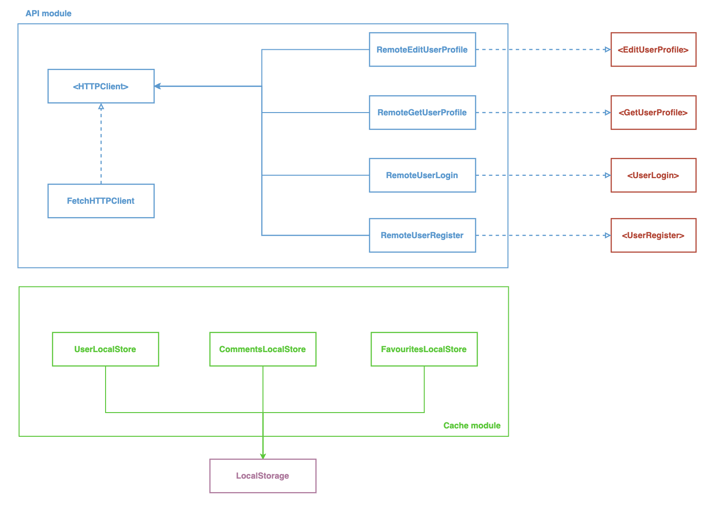

[](https://travis-ci.com/ps1312/map_app)

### Architecture




### BDD Specs:

#### Narrative #1:
```
As a guest
I want to create an account
So that i can use the app
```

#### Scenarios (Acceptance criteria):
```
Given the guest has internet connection
 When the guest submits the Create Account formulary
  And the app should receive an access token
```

```
Given the guest has no internet connection
 When the guest submits the Create Account formulary
 Then the app should display an error message
```

#### Narrative #2:
```
As a user
I want to login to my account
So that i can access the app features
```

#### Scenarios (Acceptance criteria):
```
Given the user has internet connection
 When the user submits the Login formulary
 Then the app should redirect to a secured screen
```

```
Given the guest has no internet connection
 When the user submits the Login formulary
 Then the app should display an error message
```

#### Narrative #3:
```
As a user
I want to see locals close to me as a map
So that i can know where i live
```

#### Scenarios (Acceptance criteria):
```
Given the user is on the map screen
 When the user agrees to share location
 Then the app should display close locals on the map
```

#### Narrative #4:
```
As a user
I want to see locals close to me as a list
So that i can know where i live
```

#### Scenarios (Acceptance criteria):
```
Given the user is on the map screen
 When the user agrees to share location
 Then the app should display close locals on the list
```

#### Narrative #5:
```
As a user
I want to favourite a close place
So that i can rate the place
```

#### Scenarios (Acceptance criteria):
```
Given the user is seeing close locals
 When the user click on the star button
  And complete formulary with comment and rating
 Then the app should save the favourite place
```

#### Narrative #6:
```
As a user
I want to edit my profile
So that i can update it with my current informations
```

#### Scenarios (Acceptance criteria):
```
Given the user is on profile page
 And edit their information
 Then the app should update the profile
```

#### Narrative #7:
```
As a user
I want to logout from my account
So that i can exit the application
```

#### Scenarios (Acceptance criteria):
```
Given the user is logged in
 When the user clicks on logout
 Then the app logout user
```

### Use Cases:

#### Register User Use Case

#### Data:
- URL
- Username
- Email
- Password
- Password Confirmation

#### Primary Course (happy path)
1. Execute `Create Account` with above data
2. System makes request to server
3. System receives response with account data and an access token
4. System validates received data

#### No connectivity - error course (sad path)
1. System delivers connectivity error

#### Invalid data - error course (sad path)
1. System delivers invalid data error

---

#### Login Account Use Case

#### Data:
- URL
- Username
- Password

#### Primary Course (happy path)
1. Execute `Load Account` with above data
2. System makes request to server
3. System receives response with account data and an access token
4. System validates received data

#### No connectivity - error course (sad path)
1. System delivers connectivity error

#### Invalid data - error course (sad path)
1. System delivers invalid data error

---

#### Get Nearby Places Use Case

#### Data:
- URL
- Latitude
- Longitude
- GoogleAPIKey

#### Primary Course (happy path)
1. Execute `Load Nearby Places` with above data
2. System makes request to Google Maps API
3. System receives response with list of nearby places
4. System displays places to user

#### No connectivity - error course (sad path)
1. System delivers connectivity error

---

#### Save Favourite Place Use Case

#### Data:
- ID
- Name
- Vicinity
- Coordinates
- PhotoURL

#### Primary Course (happy path)
1. Execute `Save Local` with above data
2. System add local do stored locals in cache

#### Cache did not save - error course (sad path)
1. System delivers can not save error
